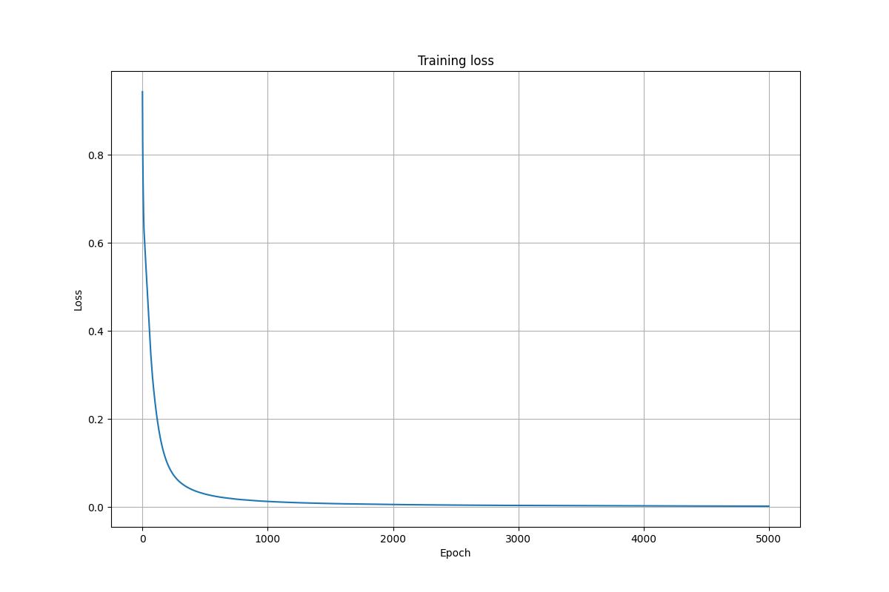
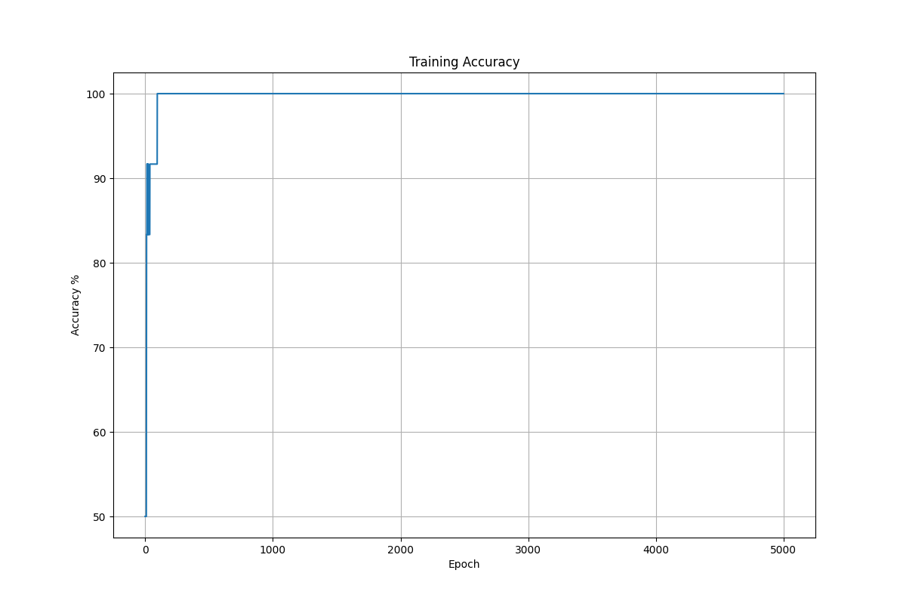

# Neural network from scratch using NumPy
## Overview
This project was built to understand the inner workings and the math of a neural network using only NumPy and Matplotlib. This includes forward propagation, backpropagation, gradient descent and weight initialization, without relying on Machine Learning libraries such as Tensorflow and PyTorch. This project's scope is binary classification with the loss function being binary cross entropy, the hidden layer activation function being leaky relu and the output layer function being sigmoid. The input data used for this is a 3 x 16 feature matrix and the output is a 16 x 1 vector with 1s and 0s. 
## Features
The following features have been implemented
1. Dense (connected layers)
2. Forward propagation
3. Backward propagation
4. Binary cross entropy loss
5. Sigmoid activation (output layer)
6. Leaky ReLU activation (hidden layers)
7. He weight initialization
8. Gradient descent optimization
9. Prediction and accuracy calculation
10. Training loss visualization
11. Training accuracy visualization
## Network architecture
1. Input layer: 3 neurons
2. Hidden layer 1: 6 neurons, leaky relu 
3. Hidden layer 2: 4 neurons, leaky relu
4. Output layer: 1 neuron, sigmoid
## Mathematical Concepts
1. Forward propagation
2. Chain rule
3. Back propagation
4. Gradient descent
5. Binary cross entropy loss
6. He initialization
7. Leaky relu activation
8. Sigmoid activation
## Training procedure
1. Initialize weights using the He initialization technique
2. Perform forward propagation
3. Compute binary cross entropy loss
4. Perform backpropagation
5. Compute gradients
6. Update weights and biases
7. Repeat for every epoch
## Results
### Training loss

### Training accuracy

## Installation
### 1. Clone the repository
```bash
git clone https://github.com/Thenewbie1011/Neural_network_from_scratch.git
```
### 2. Navigate to the project directory
```bash
cd Neural_network_from_scratch
```
### 3. Install the required dependencies
```bash
pip install -r requirements.txt
```
### 4. Run the project
```bash
python training.py
```
## Notes
Further validation is ongoing on different datasets to understand the limitations of my code and the goal is to optimize my code further in order to fit a variety of datasets. Furthermore, this project was undertaken solely for educational purposes, to understand how exactly a neural network works. 
